# Node.js

## ECMAScript et ES6
ECMAScript correspond à une version de JavaScript. 
ES6 (publié en 2015) a introduit des changements majeurs, transformant JavaScript d'un langage de script en un véritable langage de programmation.

> Les erreurs en JavaScript ont lieu pendant l'exécution du code, car il n'est pas compilé.

## Commandes utiles
- Lancer un fichier Node.js : `node <nom_fichier.js>`

- Voir la version de Node.js : `node -v`
- Voir la version de npm (Node Package Manager) : `npm -v`
- Initialiser un projet Node.js : `npm init`
- Installer une dépendance : `npm install <nom_package>`
- Installer une dépendance en mode développement : `npm install <nom_package> --save-dev`
- Installer une dépendance globalement : `npm install -g <nom_package>` -> **Déconseillé**
- Liste des dépendances : `npm list`

## Variables
- `let` : variable dont la valeur peut être modifiée, accessible dans le fichier ou le bloc où elle est déclarée (scope de bloc).
- `const` : constante dont la valeur ne peut pas être modifiée (scope de bloc).
- `var` : ancienne manière de déclarer une variable (scope de fonction), à éviter.

> - **Bonne pratique** : Utiliser `const` par défaut et `let` si modification nécessaire.
> - **Convention** : Noms descriptifs en camelCase.
> - **Principe** : Une variable doit correspondre à une seule responsabilité.

## Types de données
### Types primitifs
- **Number** : Nombre entier ou flottant
- **String** : Chaîne de caractères
    - UTF-16
    - Immuables
    - Utilisation des backticks (`` ` ``) pour le multi-ligne
- **Boolean** : `true` ou `false`
- **Null** : Valeur nulle
- **Undefined** : Variable non définie
- **Symbol** : Identifiant unique
- **BigInt** : Nombre entier de taille illimitée

> Lorsqu'on passe une variable primitive en paramètre d'une fonction, on passe une **copie** de sa valeur.

### Types complexes
- **Object** : Collection de paires clé-valeur
- **Array** : Tableau pouvant contenir des valeurs de types différents
- **Function** : Bloc de code réutilisable
    - Si on retire les accolades d'une fonction fléchée, le `return` est implicite.
    - Possibilité de retirer les parenthèses si une seule variable.
- **Date** : Date et heure via `new Date()`
- **RegExp** : Expression régulière

> Lorsqu'on passe une variable complexe, on passe une **référence** à la variable.

## Commentaires en JavaScript
- `//` : Commentaire sur une ligne
- `/* */` : Commentaire sur plusieurs lignes

## Scope et hoisting
- **Scope** : Détermine où une variable est accessible
    - `let` et `const` ont un **scope de bloc** et **ne sont pas hoistées**.
    - `var` a un **scope de fonction** et **est hoistée**.

## Mots-clés utiles
- `typeof` : Permet de connaître le type d'une variable
- `...` : Spread operator (décomposition d'un tableau)
- `new` : Création d'une instance d'un objet

## Expressions booléennes
- `==` : Comparaison de valeurs (égalité faible)
- `===` : Comparaison stricte (valeurs et types)
- `!=` : Différent
- `!==` : Différent strict

## Destructuration d'objets et de tableaux
- **Destructuration de tableaux** : Extraction de valeurs d'un objet dans des variables
    >Exemple : `const [a, b, c] = [1, 2, 3];`

- **Destructuration d'objets** : Extraction de valeurs d'un objet dans des variables en utilisant les noms des propriétés
    >Exemple : `const {x, y, z} = {w: 0, x: 1, y: 2, z: 3};`

## Threads et asynchronisme
JavaScript est **mono-thread**, il n'y a qu'un seul fil d'exécution.

### Solutions
- **Callback**
- **Promesses**
    
    Objet représentant une opération asynchrone
    
    3 états :
    - **Pending** : En attente
    - **Fulfilled** : Réussie
    - **Rejected** : Rejetée

    Format :
    - **.then()** : Si réussie
    - **.catch()** : Si rejetée
    - **.finally()** : Exécutée dans tous les cas

- **Async / await**
    - Une fonction `async` retourne toujours une promesse
    - `await` attend la résolution de la promesse
    

- **Event loop**

```mermaid {scale: 0.7}
graph TD

A[Code JavaScript] --> B[Call Stack]  
B --> C{Opération<br>synchrone?}  
C -->|Oui| D[Exécution immédiate]  
C -->|Non| E[APIs Asynchrones]  
E --> F[Callback Queue]  
F --> G[Event Loop]  
G --> H{Stack<br>vide?}  
H -->|Oui| I[Exécuter callback]  
I --> B  
H -->|Non| G  

style A fill:#42b883  
style G fill:#35495e  
```

## Module System
- **CommonJS** : Utilisé par Node.js
    - `require()` : Importer un module
    - `module.exports` : Exporter un module
- **ES Modules**
    - `import` : Importer un module
    - `export` : Exporter un module
    - `extension .mjs`

    - **Imports et exports nommés**
        - Export nommé : `export const nom = valeur;`
        - Import nommé : `import { nom } from './fichier.mjs'`

    - **Export par défaut** - Un seul par module
        - Export par défaut : `export default nom;`
        - Import par défaut : `import nom from './fichier.mjs'`

    >package.json : `"type": "module"`

